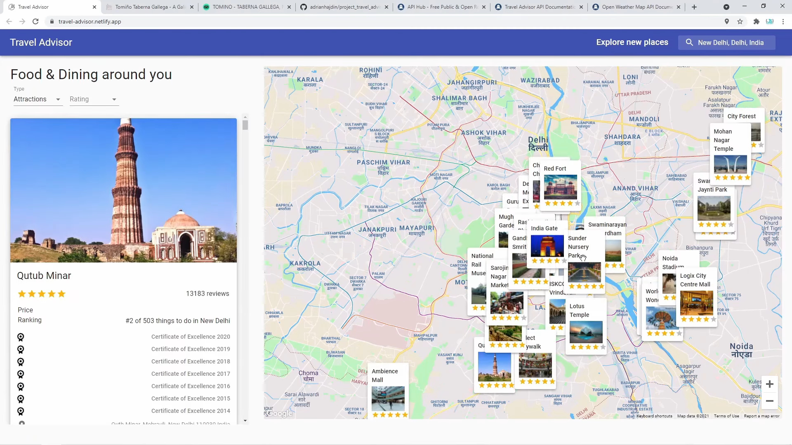

# Travel Companion App

A Website Created with React to provide hotspots of a place such as Restaurants, local Attraction and much more along with the Weather.




## Installation

Run the following command to launch a local development server. ( NodeJS required )

```terminal
npm start
```


## Contributing
Pull requests are welcome. For major changes, please open an issue first to discuss what you would like to change.

Please make sure to update tests as appropriate.

## License
[MIT](https://choosealicense.com/licenses/mit/)